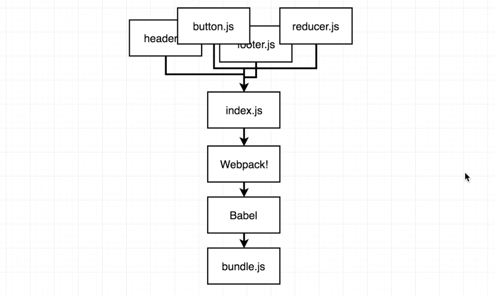

# Introduction and Setup

## Contents

1. [Server Architecture](#)
2. [Environment Setup](#)
    * [Boilerplate Setup](#)
    * [Express Setup](#)
    * [JSX on the Server](#)
    * [Server Side Webpack](#)
3. [Server Configuration](#)
    * [Rebuilding and Restarting](#)
    * [Client Side JavaScript](#)
    * [Client Bundles](#)
    * [The Public Directory](#)
4. [Refactoring](#)
    * [Merging Webpack Config](#)
    * [Single Script Startup](#)
    
---

## 1. Server Architecture

We'll run two separate backend servers for our application.


* **API Server:** Handle all the application logic, like serving the list of users, handling authentication.
* **Rendering Server:** Be responsible for rendering our application and serving it to the user. 

All the services in the API server will produce JSON. The rendering server will produce HTML.

 

The benefit to this approach is that by putting together the separate API server, we can replace the React server side rendering piece with an Angular application, or an Ember application.

---

## 2. Environment Setup

### 2.1. Boilerplate Setup

Here is how we're going to approach:

 

Let's make a `server` folder and create the `.package_json` file to install some dependencies.

```bash
cd /Users/lqin/Documents/git/react-server-side-rendering
mkdir server
cd server
npm install
```

### 2.2. Express Setup

Create the root file for our application. We only have one component `Home` for now.

```javascript
// ./server/src/index.js
//---------------------------------------------------------
const express = require('express');
const app = express();

app.listen(3000, () => {
  console.log('Listening on port 3000');
});
```

```javascript
// ./server/src/client/components/Home.js
//---------------------------------------------------------
import React from 'react';
const Home = () => {
  return <div>Home component</div>;
};
export default Home;
```

We need to take the component and create some HTML code that can be sent to the browser.

 

`ReactDOM.renderToString` will take the component and return a string.

```javascript
// ./server/src/index.js
//---------------------------------------------------------
const React = require('react');
const renderToString = require('react-dom/server').renderToString;
const Home = require('./client/components/Home').default;

app.get('/', (req, res) => {
  const content = renderToString(<Home />);
  res.send(content);
});
```

The code above will not work since JSX (`<Hone />`) here can not be recognized by the backend server.

### 2.3. JSX on the Server

Let's think of how we usually handle JSX on the client:

 

We import many different components into a single file `index.js` and went through `Webpack` and `Babel`. We want to follow this implementation and feeds everything into `Webpack` and `Babel` to create `bundle.js`.

```javascript
// ./server/webpack.server.js
//---------------------------------------------------------
const path = require('path');

module.exports = {
  // Inform Webpack that we're building a bundle for nodeJS,
  // rather than for the browser (default).
  target: 'node',
  
  // Tell webpack the root file of our server application.
  entry: './src/index.js',
  
  // Tell webpack where to put the output file that is generated.
  output: {
    filename: 'bundle.js',
    path: path.resolve(__dirname, 'build') // Use 'path' module from node.
  },
  
  // Tell webpack to run babel on every file it runs through
  module: {
    rules: [
      {
        test: /\.js?$/, // Apply babel to only js files
        loader: 'babel-loader', // Webpack loader to transpile files
        exclude: /node_modules/,
        options: {
          presets: [
            'react',   // Translate JSX files
            'stage-0', // Take some async codes
            ['env', { target: { browsers: ['last 2 versions'] } }]
          ]
        }
      }
    ]
  }
};
```

### 2.4. Server Side Webpack

After we configured Webpack, the last thing is to make sure that we can run Webpack:

```javascript
// ./server/package.json
//---------------------------------------------------------
...
"scripts": {
  "dev:build:server": "webpack --config webpack.server.js"
},
...
```

We can then go to the `server` folder and run `npm run dev:build:server`. New file will be generated in `./server/build/`. We can then run `node build/bundle.js` to see the response from Express server. All JSX files are processed without error. You can then go to `http://localhost:3000` to view the `Home` component.

That is the first taste of server side rendering. To wrap up, we have two issues:

 

---

## 3. Server Configuration

### 3.1. Rebuilding and Restarting

Although we have a basic setup for the server side rendering, we still have some issues. If we change some text in the `Home` component, we can not simply refresh the browser to see the new content. We need to rebuild the `bundle.js` and restart node server every time.

We want to rerun the webpack and restart our server automatically when a file get changed.

 

* Rerun webpack: Just add `--watch` in `package.json`.
* Restart node: use `nodemon` and run `node build/bundle.js` whenever the file in `build` dir gets modified.

```javascript
// ./server/package.json
//---------------------------------------------------------
...
"scripts": {
  "dev:server": "nodemon --watch build --exec \"node build/bundle.js\"", // Only watch the file in `build/` dir.
  "dev:build:server": "webpack --config webpack.server.js --watch"
},
...
```

We can open two terminal windows and run the two command to test:

```bash
npm run dev:server
npm run dev:build:server
```

Since the backend code will go through Webpack, we can use ES2015 module:

```javascript
// ./server/src/index.js
//---------------------------------------------------------
import express from 'express';
import React from 'react';
import { renderToString } from 'react-dom/server';
import Home from './client/components/Home';
...
```

### 3.2. Client Side JavaScript

The browser now receives the HTML code generated by `renderToString()`. But we'll have a problem if we modify the `Home` component:

```javascript
// ./server/src/client/components/Home.js
//---------------------------------------------------------
const Home = () => {
  return (
    <div>
      <div>This is home.</div>
      <button onClick={() => console.log('Hi')}>Press</button>
    </div>
  );
};
```
The reason is that there is not JavaScript code being sent to user's browser right now. We can only get HTML from `Home` component and nothing else.

After getting something shown on the screen, we need to make sure that we load up the React application and have the application set up all the event handlers and action creators...

### 3.3. Client Bundles

To make sure the application runs normally, we need to create two bundles. We have already created the first one.

 

In order to get the second bundle, we'll setup another webpack pipeline.

```javascript
// ./server/webpack.client.js
//---------------------------------------------------------
const path = require('path');

module.exports = {
  // Tell webpack the root file of the client-side app.
  entry: './src/client/client.js',
  
  // Tell webpack where to put the output file that is generated.
  output: {
    filename: 'bundle.js',
    path: path.resolve(__dirname, 'public')
  },
  
  // Tell webpack to run babel on every file it runs through
  module: {
    rules: [
      {
        test: /\.js?$/, // Apply babel to only js files
        loader: 'babel-loader', // Webpack loader to transpile files
        exclude: /node_modules/,
        options: {
          presets: [
            'react',   // Translate JSX files
            'stage-0', // Take some async codes
            ['env', { target: { browsers: ['last 2 versions'] } }]
          ]
        }
      }
    ]
  }
};
```

Add a little bit of code in `client.js` to start:

```javascript
// ./server/src/client/client.js
//---------------------------------------------------------
console.log('Hi client!');
```

Add a command to build client-side bundle in `package.json`.

```javascript
// ./server/package.json
//---------------------------------------------------------
...
"scripts": {
  "dev:server": "nodemon --watch build --exec \"node build/bundle.js\"",
  "dev:build:server": "webpack --config webpack.server.js --watch",
  "dev:build:client": "webpack --config webpack.client.js --watch"
},
...
```

We can then run `npm run dev:build:client` and a file `server/public/bundle.js` will be generated.

### 3.4. The Public Directory

We want the browser to automatically pick up the newly created client-side bundle. We need to tell Express to treat the `public` directory as a freely available public directory.

```javascript
// ./server/src/index.js
//---------------------------------------------------------
app.use(express.static('public'));
app.get('/', (req, res) => {
  const content = renderToString(<Home />);
  const html = `
    <html>
      <head></head>
      <body>
        <div>${content}</div>
        <script src="bundle.js"></script>
      </body>
    </html>
  `;
  res.send(html);
});
```

### 3.5. Client Bootup

We can treat `/server/src/client/client.js` as our normal React start-up location:

```javascript
// ./server/src/client/client.js
//---------------------------------------------------------
import React from 'react';
import ReactDOM from 'react-dom';
import Home from './components/Home';

// The second parameter is the dom element to render to.
ReactDOM.hydrate(<Home />, document.querySelector('#root'));
```

Now the `client.js` will go over all existing HTML code and add event handlers to them.

---

## 4. Refactoring

### 4.1. Merging Webpack Config

Now there are lots of duplicate setup in the two webpack config files. Let's extract the duplicate parts into a separate file. We'll use a little library `webpack-merge` to do so.

 

```javascript
// ./server/webpack.base.js
//---------------------------------------------------------
module.exports = {
  // Tell webpack to run babel on every file it runs through
  module: {
    rules: [
      {
        test: /\.js?$/, // Apply babel to only js files
        loader: 'babel-loader', // Webpack loader to transpile files
        exclude: /node_modules/,
        options: {
          presets: [
            'react',   // Translate JSX files
            'stage-0', // Take some async codes
            ['env', { target: { browsers: ['last 2 versions'] } }]
          ]
        }
      }
    ]
  }
};
//---------------------------------------------------------
// ./server/webpack.client.js, ./server/webpack.server.js
//---------------------------------------------------------
const path = require('path');
const merge = require('webpack-merge');
const baseConfig = require('./webpack.base.js');

const config = {...};

module.exports = merge(baseConfig, config);
```

### 4.2. Single Script Startup

We now have 3 scripts to start our application. It would be nice if we can run only one command. We need a module `npm-run-all` to do that.

```javascript
// ./server/package.json
//---------------------------------------------------------
...
"scripts": {
  "dev": "npm-run-all --parallel dev:*",
  ...
},
...
```
