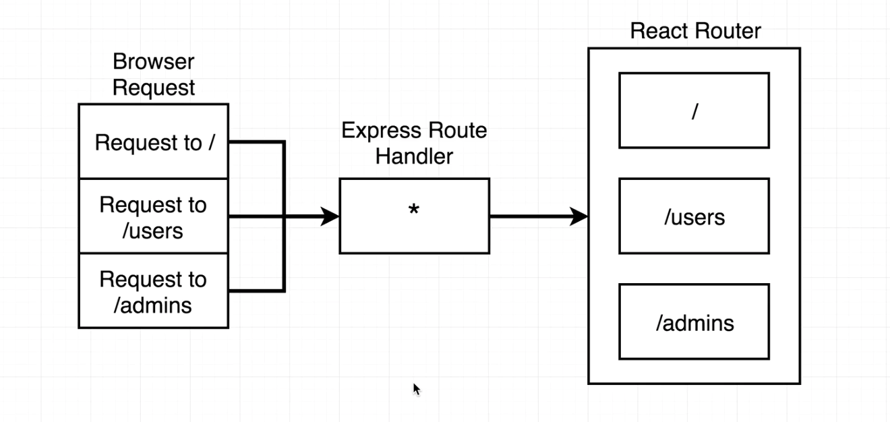
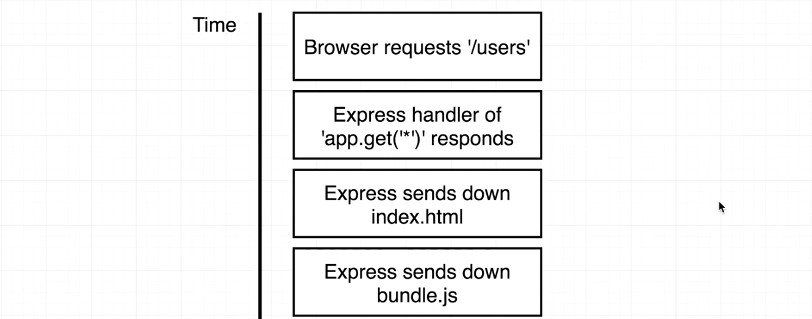
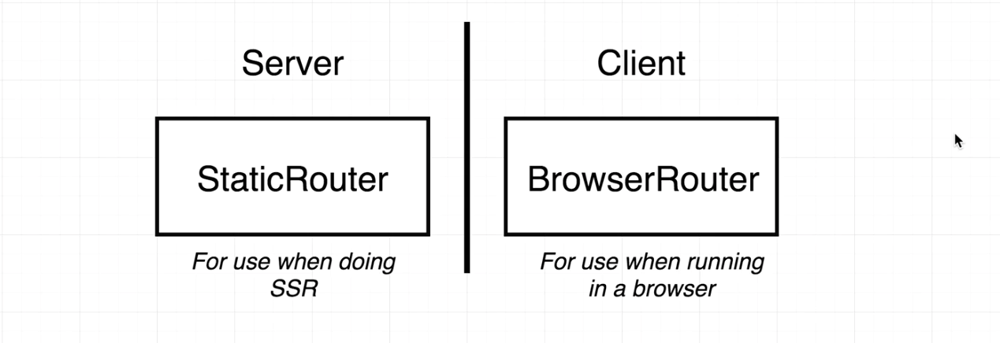
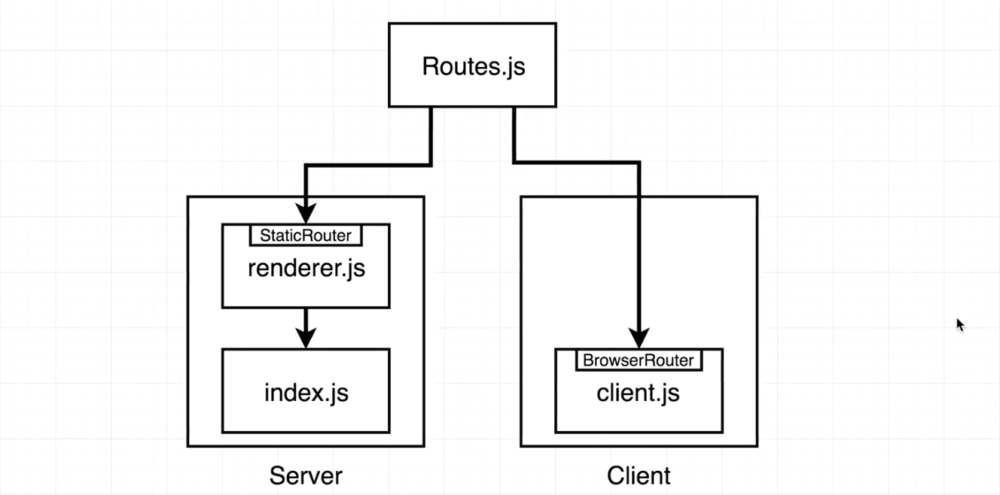
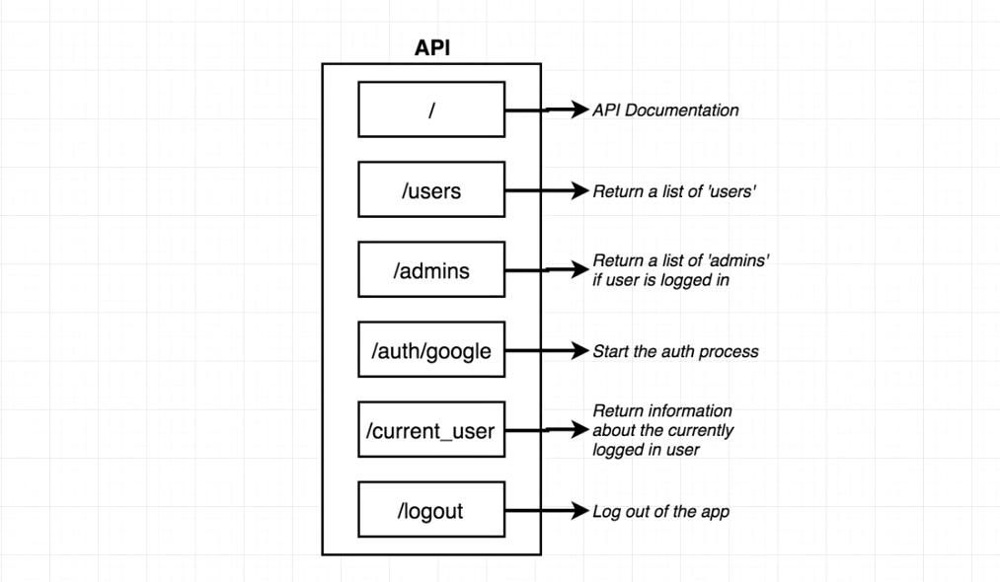
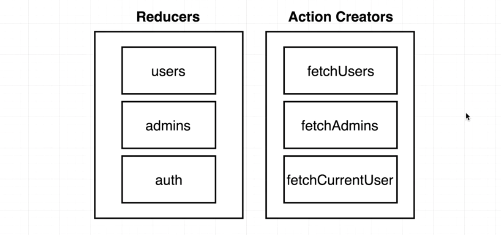
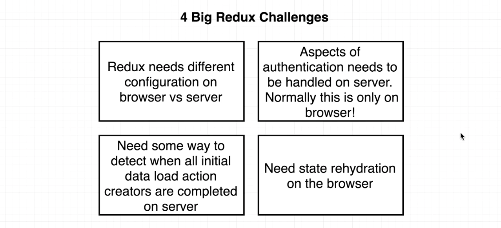

# Adding Navigation and Redux

## Contents

1. [Adding Navigation](#)
    * [Implementing React Router Support](#)
    * [BrowserRouter vs StaticRouter](#)
    * [Route Configuration](#)
2. [Integrating Support for Redux](#)
    * [The Users API](#)
    * [Four Challenges for Redux Setup](#)
    * [Browser Store Creation](#)
    * [Server Store Creation](#)
3. [Implementing Basic Action Creators and Reducers](#)
    * [FetchUser Action Creator and the User Reducer](#)
    * [Reducer Imports](#)
    * [UserList Component](#)
    
  
---

## 1. Adding Navigation

### 1.1. Implementing React Router Support

At present our app only shows one single component. There will be two separate tiers of routing inside of our application.

* **Tier 1:** Express routing layer. Express will not enforce any routing rules on any incoming requests. It will delegate all routing to react router.
* **Tier 2:** React router.

We can add some routes for some API handlers or outside requests to Express router, but for anything that is meant to show HTML, we're always going to make sure that react router is in charge of that request.



### 1.2. BrowserRouter vs StaticRouter

Let's take a look at how react-router works on a normal application without server side rendering:




In the end, `BrowserRouter` is completely hardcoded and will look at the url in the address bar. But we don't have an address bar when rendering the app in the server, which means if we tried to use the `BrowserRouter` as we are very used to doing, we'd get an error message.

Here is what we're going to do instead: We'll have two routers. The `StaticRouter` is included in the `react-router` library, and it is specifically made for use on the server with server side rendering.

The when the app gets shipped to the browser and gets rendered a second time (`hydrated` as we call it), we'll use `BrowserRouter` instead.



How should we approach the implementation: We'll have one distinct set of route mappings (`Routes.js`) and consume those routes slightly differently on the server versus the client. The api doc for `StaticRouter` can be viewed here: [https://reacttraining.com/react-router/web/api/StaticRouter](https://reacttraining.com/react-router/web/api/StaticRouter).



### 1.3. Route Configuration

Let's create `Routes.js` mentioned above. This is a component and will be shared btw the cliend and the server.

```javascript
// ./server/src/client/Routes.js
//---------------------------------------------------------
import React from 'react';
import { Route } from 'react-router-dom';
import Home from './components/Home';

export default () => {
  return (
    <div>
      <Route exact path="/" component={Home} />
      <Route path="/hi" component={() => "Hi"} /> // For test
    </div>
  );
}
```

Then we should import the routes setting into the files `client.js` and `index.js` (actually `renderer.js` for server side). 

```javascript
// ./server/src/client/client.js
//---------------------------------------------------------
import React from 'react';
import ReactDOM from 'react-dom';
import { BrowserRouter } from 'react-router-dom';
import Routes from './Routes';

ReactDOM.hydrate(
  <BrowserRouter>
    <Routes />
  </BrowserRouter>, 
  document.querySelector('#root')
);
```

```javascript
// ./server/src/helpers/renderer.js
//---------------------------------------------------------
import React from 'react';
import { renderToString } from 'react-dom/server';
import { StaticRouter } from 'react-router-dom';
import Routes from '../client/Routes';

export default () => {
  // The 'context' parameter is required, we passed in an empty object.
  const content = renderToString(
    <StaticRouter context={{}}>
      <Routes />
    </StaticRouter>
  );
  
  return `
    <html>
      <head></head>
      <body>
        <div id="root">${content}</div>
        <script src="bundle.js"></script>
      </body>
    </html>
  `;
};
```

One thing we need to notice is that `BrowserRouter` has the ability to look into the address bar to get the url, but we need a way to pass the request object `req` to `StaticRouter` so that `StaticRouter` can know the current url. We pass it as an argument to the `renderer()` function.

Then we can use `req.path` and pass it to `StaticRouter` as `location`: [http://expressjs.com/en/api.html#req.path](http://expressjs.com/en/api.html#req.path)

```javascript
// ./server/src/index.js
//---------------------------------------------------------
...
// Let express catch all routes
app.get('*', (req, res) => {
  res.send(renderer(req));
});
...
//---------------------------------------------------------
// ./server/src/helpers/renderer.js
//---------------------------------------------------------
...
export default (req) => {
  // The 'context' parameter is required, we passed in an empty object.
  const content = renderToString(
    <StaticRouter location={req.path} context={{}}>
      <Routes />
    </StaticRouter>
  );
  ...
}
...
```

---

## 2. Integrating Support for Redux

### 2.1. The Users API

Now we have the routers set up. We want to continue with our mockup and display a list of fake users and admins. We'll use the API: [http://react-ssr-api.herokuapp.com/](http://react-ssr-api.herokuapp.com/).



### 2.2. Four Challenges for Redux Setup

To wire up Redux with our application, we have some reducers and action creators:



But since we are trying server side rendering, we may have 4 challenges for Redux.



1. Based on other 3 problems, Redux behaves differently on the server versus the client. We're going to create two different stores and have one store for the browser bundle and one store for the server bundle.

2. Our API uses cookie-based authentication. However, when our app is rendered on the server, we don't have easy access to the cookie data that proves that the user is authenticated.

3. Normally we can call an action creator if we want to update some data, and the app-level state get automatically updated. So we don't get a signal of when these action creators have completed fetching data. But on the server, when we attempt to fetch some data, we need to know the exact instant that the request issued by an action creator is finished. So that we can render the app the a string and send it back down to the browser.

4. We have to go through a rehydration process with Redux (similar to the rehydration process for React). When Redux boots up in the browser, it needs some initial kickstart to let it take the existing state and start itself with it.

### 2.3. Browser Store Creation

Creating two stores with Redux is going to be a lot like how we did with react-router. We'll make on in `renderer.js` and one in `client.js`.

```javascript
// ./server/src/client/client.js
//---------------------------------------------------------
...
import { createStore, applyMiddleware } from 'redux';
import thunk from 'redux-thunk';
import { Provider } from 'react-redux'; // Ties the store with our react app
// Create a redux store
// @param: reducers, initial state, middlewares
const store = createStore(reducers, {}, applyMiddleware(thunk));
// Anytime the store got changes, the 'Provider' will notice that and update related components.
ReactDOM.hydrate(
  <Provider store={store}>
    <BrowserRouter>
      <Routes />
    </BrowserRouter>
  </Provider>,
  document.querySelector('#root')
);
```

### 2.4. Server Store Creation

Create a new file to contain all the code needed for a redux store of the server. Since we don't want to make `renderer.js` too large.

We'll not include `Provider` here since the purpose of this file is only to create a server-side redux store and immediately use it in the react application.

The redux store we're creating on the server will be slightly different than the client, since we need to do some detection of when we finish all of our initial data loading before we attempt to actually render our application.

```javascript
// ./server/src/helpers/createStore.js
//---------------------------------------------------------
import { createStore, applyMiddleware } from 'redux';
import thunk from 'redux-thunk';
export default () => {
  const store = createStore(reducers, {}, applyMiddleware(thunk));
  return store;
};
```

Since we'll try to load data before we render the application, so the store will be created inside the route handler inside `index.js`, not `renderer.js`. After we've done all the store initialization and data loading, we'll then pass the store to `renderer()`, where it can be used by the provider function.

```javascript
// ./server/src/index.js
//---------------------------------------------------------
...
import createStore from './helpers/createStore';
...
app.get('*', (req, res) => {
  const store = createStore();
  // Some logic to initialize and load data into store.
  res.send(renderer(req, store));
});
...
//---------------------------------------------------------
// ./server/src/helpers/renderer.js
//---------------------------------------------------------
...
import { Provider } from 'react-redux';
export default (req, store) => {
  // The 'context' parameter is required, we passed in an empty object.
  const content = renderToString(
    <Provider store={store}>
      <StaticRouter location={req.path} context={{}}>
        <Routes />
      </StaticRouter>
    </Provider>
  );
  ...
}
```

---

## 3. Implementing Basic Action Creators and Reducers

### 3.1. FetchUser Action Creator and the User Reducer

We've created a store on both the client and the server. Now it's time to start working on some action creators and reducers to use inside of our application.

```javascript
// ./server/src/client/actions/index.js
//---------------------------------------------------------
import axios from 'axios';
export const FETCH_USERS = 'fetch_users';
export const fetchUsers = () => async dispatch => {
  const res = await axios.get('http://react-ssr-api.herokuapp.com/users');
  dispatch({
    type: FETCH_USERS,
    payload: res;
  });
};
//---------------------------------------------------------
// ./server/src/client/reducers/usersReducer.js
//---------------------------------------------------------
import { FETCH_USERS } from '../actions';
export default (state = [], action) => {
  switch (action.type) {
    case FETCH_USERS:
      return action.payload.data;
    default:
      return state;
  }
}
//---------------------------------------------------------
// ./server/src/client/reducers/index.js
//---------------------------------------------------------
import { combineReducers } from 'redux';
import usersReducer from './usersReducer';
export default combineReducers({
  users: usersReducer
});
```

### 3.2. Reducer Imports

Next we need to import the `combineReducers` call into the stores (both the `client.js` and the `helpers/createStore.js` file).

```javascript
// ./server/src/client/client.js
//---------------------------------------------------------
import reducers from './reducers';
...
//---------------------------------------------------------
// ./server/src/helpers/createStore.js
//---------------------------------------------------------
import reducers from '../client/reducers';
...
```

### 3.3. UserList Component

Since the basic Redux setup is done, we will create a new component to show the list of users. Note that we can not call the action creator in `componentDidMount()` directly like what we do in the client side, we'll come back to it soon:

```javascript
// ./server/src/client/components/UsersList.js
//---------------------------------------------------------
import React, { Component } from 'react';
import { connect } from 'react-redux';
import { fetchUsers } from '../actions';

class UsersList extends Component {
  componentDidMount() {
    // this.props.fetchUsers();
  }
  
  // Helper function
  renderUsers() {
    return this.props.users.map(user => {
      return <li key={user.id}>{user.name}</li>;
    })
  }
  
  render() {
    return (
      <div>
        Here is a list of users.
        <ul>{this.renderUsers()}</ul>
      </div>
    );
  }
}

function mapStateToProps(state) {
  return { users: state.users };
}

export default connect(mapStateToProps, { fetchUsers })(UsersList);

//---------------------------------------------------------
// ./server/src/client/Routes.js
//---------------------------------------------------------
...
import UsersList from './components/UsersList';
export default () => {
  ...
  <Route path="/users" component={UsersList} />
  ...
}
```

Note that we use `async` in the action creator `./server/src/client/action/index.js`. Whenever you use the `async-await` syntax, Babel assumes that there is something called `regeneratorRuntime` defined inside of your working environment. If we call the action creator directly from `componentDidMount()`, Babel will complain because we didn't set up everything correctly.

To fix this issue, we need to run through `babel-polyfill` to define some functions that Babel wants to use in the top-level `index.js` file. We also need to use it in the client side.

```javascript
// ./server/src/index
//---------------------------------------------------------
import 'babel-polyfill';
...
//---------------------------------------------------------
// ./server/src/client/client.js
//---------------------------------------------------------
import 'babel-polyfill';
```

Not the list of users will be shown on the screen: http://localhost:3000/users.

The list of users was still rendered on the client-side. There is no server side rendering going on here yet. We'll work with server-side rendering Redux in the next section.

