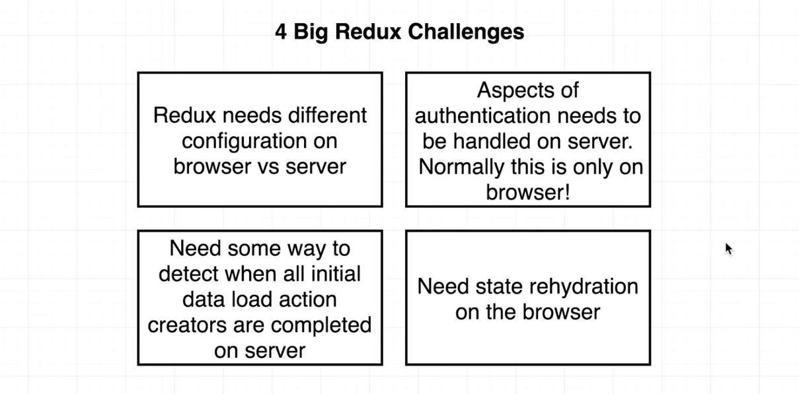
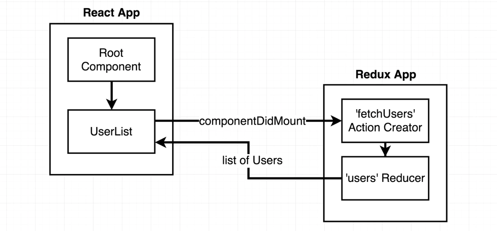
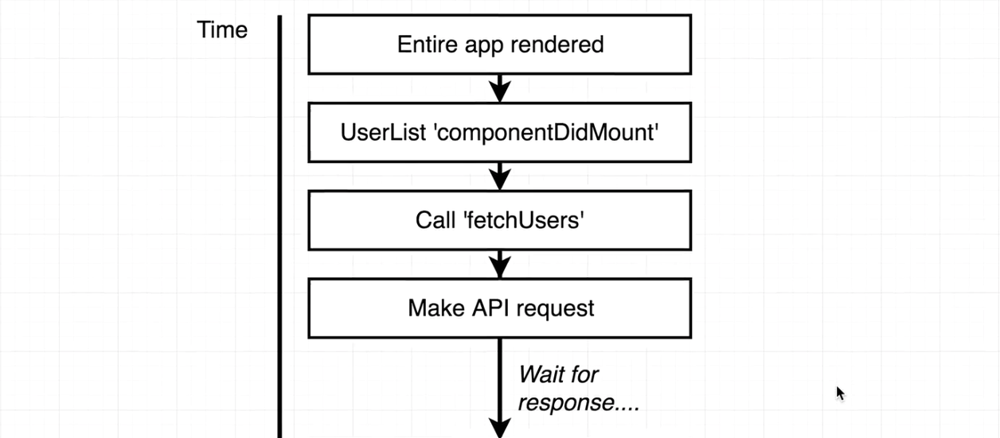
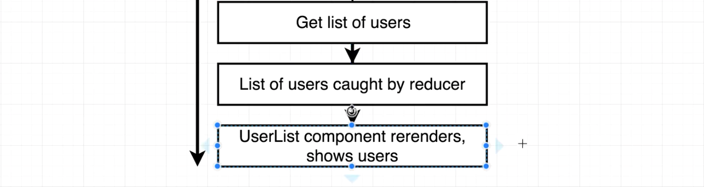

# Server Side Data Loading

## Contents

1. [aaa](#)
    * [Detecting Data Load Completion](#)
    * [Solution #1 for Data Loading](#)
    * [aaa](#)
    * [aaa](#)
    * [aaa](#)
    * [aaa](#)
    * [aaa](#)
    
    
  
---

## 1. aaa

### 1.1. Detecting Data Load Completion

In the last section we put together some infrastructure for the redux side of our app. Now we can get back to figuring out how we're going to solve our four big challenges around server side rendering with Redux.



We've setup two copies of Redux, one on the server and one on the client. The next problem is how to detect that data loading has been completed during the server side rendering process.

Here is the diagram to help us understand how users data loading is working on the browser right now:







Let's think about this flow and apply it to our world of server side rendering. We want to do that by looking back at the `renderer.js` file that gets executed on the server.

In that file, we take the redux store and use it to render the react application with `renderToString()`. We put is to html content and instantly send the response to the client side. There is no code there to allow for any time to do any data fetching at all. `componentDidMount` never get called in the server.

Let's discuss how to solve this issue.

### 1.2. Solution #1 for Data Loading

```javascript
// ./server/src/client/Routes.js
//---------------------------------------------------------
```